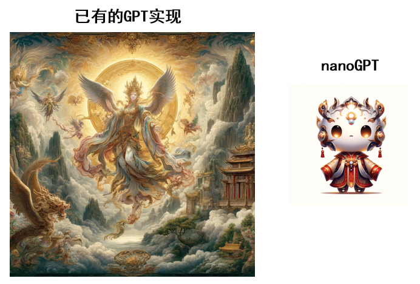

<h1 align="center">
  nanoGPT中文Tutorial
</h1>

  </a>

   对新手更友好的中文nanoGPT教程 

**该仓库在持续更新中.**

   📺 <a href="https://www.bilibili.com/video/BV1XJ4m1P7uj/?vd_source=32f9de072b771f1cd307ca15ecf84087" target="_blank">BiliBili</a>
   🌐:<a href="https://youtube.com" target="_blank">youtube</a> 

 

  

## 🗂️ 目录
- [📌 关于本教程](#-llama中文社区)

- [🍄 中文版nanoGPT项目readme](#-如何使用llama模型)

+ [🤖 中文预训练数据集搜集](#-模型预训练)
+ [💡 超级详细的nanoGPT视频教程](#-模型微调)
* [💪 对话能力实现](#-模型评测)
  
* [📖 目前已有的nanoGPT资料收集 ](#-学习中心)
    * [📺 视频](#-致谢)
    * [💻 博客](#-问题反馈)

- [📌 其它](#-其它)
  * [🎉 致谢](#-致谢)
  * [🤔 问题反馈](#-问题反馈)

## 📌 关于本教程

### 🔥 为什么还要去做nanoGPT的中文版教程

作为karpathy大神开源的目前已经获得三万多⭐的项目，nanoGPT是每个NLP爱好者入门必修项目。我必须承认karpathy在其Youtube视频课程中已经讲述的十分清楚，但是国内目前公开的视频网站或者博客，大多是将原版教学视频进行机翻，亦或者将直接对成型项目的代码进行逐行解读；鲜有对于下游任务的扩展以及整体项目的讲解。

### 🎯 我会去做什么

我会对目前已有的资料进行整理，同时发布一个相对全面的教学视频

## 🍄 中文版nanoGPT项目readme

   我对nanoGPT项目进行了精细的中文翻译，也许会对初学者有所帮助 <a href="ChineseInital.md">中文版</a>

## 🤖  中文预训练数据集

这里会搜集一些小型的，适合于nanoGPT进行训练的中文数据集的仓库 其大多是常用的NLP训练语料，但我给出整理数据以适应nanoGPT的要求

目前已有：

>[chinese-poetry/chinese-poetry: The most comprehensive database of Chinese poetry 🧶最全中华古诗词数据库, 唐宋两朝近一万四千古诗人, 接近5.5万首唐诗加26万宋诗. 两宋时期1564位词人，21050首词。 (github.com)](https://github.com/chinese-poetry/chinese-poetry)
>
>[garychowcmu/daizhigev20: 殆知阁古代文献 (github.com)](https://github.com/garychowcmu/daizhigev20)
>
>[《西游记》全集,txt全集下载,电子书-奇书网 (qishuta.org)](https://www.qishuta.org/Shtml5132.html)

## 💡 超级详细的nanoGPT视频教程

* **讲解文档**

> Lecture1 : [教程初衷](Lecture/l1.ipynb)
>
> Lecture2 : [基础GPT框架构造与初步效果](Lecture/l2.ipynb) ，[https://www.bilibili.com/video/BV1XJ4m1P7uj/?vd_source=32f9de072b771f1cd307ca15ecf84087]
>
> Lecture3 : [均值自注意力的几种方式数学推导](Lecture/l3.ipynb) ，[视频在制作中 ]
>
> Lecture4 : [搭建自注意力的准备工作](Lecture/l4.ipynb) ，[视频在制作中 ]
>
> Lecture5 : [Q,K,V的引入以及多头自注意力的实现](Lecture/l5.ipynb) ，[视频在制作中 ]
>
> Lecture6 : [对话能力实现](Lecture/l4.ipynb) ，[视频在制作中 ]

>
>
>

> Lecture+ : [对于编码解码方式的讨论](Lecture/ln.ipynb) 

## 💪 对话能力实现
主要参考[VatsaDev/nanoChatGPT: nanogpt turned into a chat model (github.com)](https://github.com/VatsaDev/nanoChatGPT)

## 📖 目前已有的nanoGPT资料收集

### 视频资料
>[(30) Let's build GPT: from scratch, in code, spelled out. - YouTube](https://www.youtube.com/watch?v=kCc8FmEb1nY&t=5828s)
>
>[从零开始手搓一个LLM（一）把参数缩减到足够单卡训练的NanoGPT_哔哩哔哩_bilibili](https://www.bilibili.com/video/BV1hr42147xc/?spm_id_from=333.337.search-card.all.click&vd_source=32f9de072b771f1cd307ca15ecf84087)
>
>[【自制中英字幕】【Andrej Karpathy】让我们从头开始，在代码中构建GPT_哔哩哔哩_bilibili](https://www.bilibili.com/video/BV1QY4y1o7ur/?vd_source=e1ce38727d77aa0b8bdfa4293878d29f)
>
>

### 博客资料

> [NanoGPT Tutorial - WHY42 (riguz.com)](https://riguz.com/NanoGPT_Tutorial)
>
> [Andrej Karpathy 的 nanoGPT lecture demo 详解 - 知乎 (zhihu.com)](https://zhuanlan.zhihu.com/p/682466360)
>
> [Andrej Karpathy 的 nanoGPT lecture demo 详解 - 知乎 (zhihu.com)](https://zhuanlan.zhihu.com/p/682466360)
>
> [迷你版ChatGPT开源，教你怎么用nanoGPT训练一个写小说的AI机器人！ - 知乎 (zhihu.com)](https://zhuanlan.zhihu.com/p/635483902)
>
> [NanoGPT的Pytorch2.0版本实现及分析 - 知乎 (zhihu.com)](https://zhuanlan.zhihu.com/p/611191403)

### 开源仓库

>[karpathy/nanoGPT: The simplest, fastest repository for training/finetuning medium-sized GPTs. (github.com)](https://github.com/karpathy/nanoGPT)
>
>[HuZixia/nanoGPT-lecture: This nanoGPT-lecture code git, including Andrej Karpathy's nanoGPT, ng-vedio-lecture, gpt_dev.ipynb and my learning notes. Welcome to like and follow (github.com)](https://github.com/HuZixia/nanoGPT-lecture)
>
>[VatsaDev/nanoChatGPT: nanogpt turned into a chat model (github.com)](https://github.com/VatsaDev/nanoChatGPT)
>
>[Andrei-Aksionov/nanoGPTplus (github.com)](https://github.com/Andrei-Aksionov/nanoGPTplus)
>
>https://github.com/sanjeevanahilan/nanoChatGPT

## 📌 其它

### 🎉 致谢

暂无

### 🤔 问题反馈

如有问题，请在GitHub Issue中提交，在提交问题之前，请先查阅以往的issue是否能解决你的问题,目前项目还处于更新阶段，请耐心等待。

